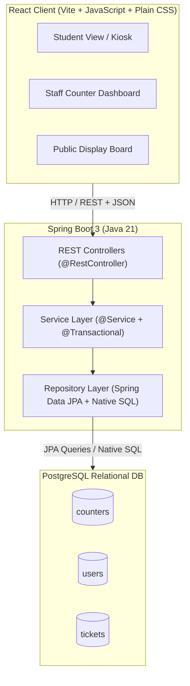
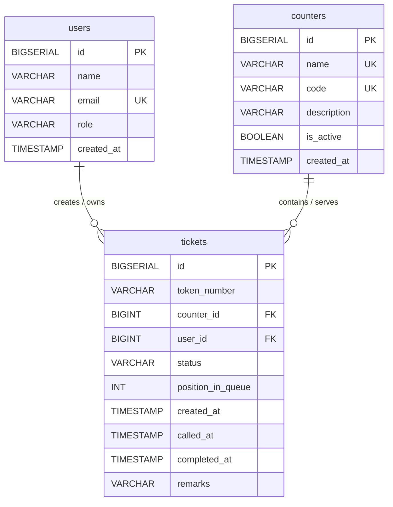

# CampusQueue — System Architecture & Implementation Design

CampusQueue is a lightweight, production-grade digital queue-management system designed for university service counters (Accounts Office, Placement Cell, Administration Office, Library Help Desk, Student Services).

This document outlines the complete architectural design, database specifications, API contracts, frontend component hierarchy, and key technical trade-offs before implementation begins.

---

## 1. System Architecture

The application follows a classic, resilient 3-tier architecture with clear separation of concerns:



### Layered Architecture Flow
1. **Presentation Layer (React)**: Handles user interactions, displays queue state, and periodically polls REST endpoints (every 3–5 seconds) to fetch updated queue status without heavy WebSocket overhead.
2. **Controller Layer (`@RestController`)**: Validates incoming DTOs, maps HTTP verbs (`GET`, `POST`, `PATCH`), and converts domain responses to standard JSON response objects.
3. **Service Layer (`@Service`, `@Transactional`)**: Implements core queue business rules, state transitions (`WAITING` $\rightarrow$ `SERVING` $\rightarrow$ `COMPLETED` / `CANCELLED`), and transaction boundaries.
4. **Data Access Layer (`@Repository`)**:
   - **Spring Data JPA**: Used for standard CRUD and entity relationship management.
   - **Native PostgreSQL Queries**: Used for queue analytics, waiting-time estimations, and concurrency-safe token calling.
5. **Database (PostgreSQL)**: Enforces relational integrity, foreign keys, unique constraints, and atomic row locking.

---

## 2. Database Schema Design

For the MVP, we use strictly **3 core tables** to keep the design lean, normalized, and easy to maintain: `users`, `counters`, and `tickets`.



---

## 3. Tables, Columns, Constraints & Indexes

### Table 1: `users`
Represents students and staff members in the system.

| Column Name | Data Type | Constraints | Description |
| :--- | :--- | :--- | :--- |
| `id` | `BIGSERIAL` | `PRIMARY KEY` | Auto-incrementing unique user identifier |
| `name` | `VARCHAR(100)` | `NOT NULL` | Full name of the user |
| `email` | `VARCHAR(150)` | `NOT NULL, UNIQUE` | College email address |
| `role` | `VARCHAR(20)` | `NOT NULL, CHECK (role IN ('STUDENT', 'STAFF', 'ADMIN'))` | Role of the user |
| `created_at` | `TIMESTAMP WITH TIME ZONE` | `NOT NULL DEFAULT CURRENT_TIMESTAMP` | Timestamp of registration |

### Table 2: `counters`
Represents the physical or administrative service desks.

| Column Name | Data Type | Constraints | Description |
| :--- | :--- | :--- | :--- |
| `id` | `BIGSERIAL` | `PRIMARY KEY` | Auto-incrementing unique counter identifier |
| `name` | `VARCHAR(100)` | `NOT NULL, UNIQUE` | E.g., 'Accounts Office', 'Placement Cell' |
| `code` | `VARCHAR(10)` | `NOT NULL, UNIQUE` | Short prefix for tokens: 'ACC', 'PLC', 'ADM', 'LIB', 'STU' |
| `description` | `VARCHAR(255)` | `NULL` | Service details and desk location |
| `is_active` | `BOOLEAN` | `NOT NULL DEFAULT TRUE` | Whether the counter is currently accepting tokens |
| `created_at` | `TIMESTAMP WITH TIME ZONE` | `NOT NULL DEFAULT CURRENT_TIMESTAMP` | Record creation timestamp |

### Table 3: `tickets`
Represents the queue tokens issued to students.

| Column Name | Data Type | Constraints | Description |
| :--- | :--- | :--- | :--- |
| `id` | `BIGSERIAL` | `PRIMARY KEY` | Auto-incrementing ticket ID |
| `token_number` | `VARCHAR(20)` | `NOT NULL` | Human-readable token code (e.g. `ACC-001`) |
| `counter_id` | `BIGINT` | `NOT NULL, REFERENCES counters(id) ON DELETE RESTRICT` | Target service counter |
| `user_id` | `BIGINT` | `NOT NULL, REFERENCES users(id) ON DELETE CASCADE` | Student who booked the ticket |
| `status` | `VARCHAR(20)` | `NOT NULL, CHECK (status IN ('WAITING', 'SERVING', 'COMPLETED', 'CANCELLED', 'SKIPPED'))` | Current lifecycle state |
| `created_at` | `TIMESTAMP WITH TIME ZONE` | `NOT NULL DEFAULT CURRENT_TIMESTAMP` | Token generation timestamp |
| `called_at` | `TIMESTAMP WITH TIME ZONE` | `NULL` | When staff clicked "Call Next" |
| `completed_at` | `TIMESTAMP WITH TIME ZONE` | `NULL` | When ticket was finished or closed |
| `remarks` | `VARCHAR(255)` | `NULL` | Optional notes entered by staff |

### Indexes & Performance Constraints
1. **Queue Processing Index**:
   ```sql
   CREATE INDEX idx_tickets_counter_status ON tickets(counter_id, status, created_at ASC);
   ```
   *Rationale*: Speeds up fetching the next `WAITING` ticket in FIFO order and counting active queue size.
2. **Student Active Ticket Index**:
   ```sql
   CREATE INDEX idx_tickets_user_status ON tickets(user_id, status);
   ```
   *Rationale*: Quickly finds if a student currently has an active ticket.
3. **Daily Reporting Index**:
   ```sql
   CREATE INDEX idx_tickets_created_at ON tickets(created_at);
   ```
   *Rationale*: Accelerates daily stats, token resetting, and reporting queries.

---

## 4. Entity Relationships Explained

1. **`counters` to `tickets` (One-to-Many / $1 : N$)**:
   - One counter can have many tickets over time.
   - Each ticket is bound to exactly one counter.
   - If a counter has existing historical tickets, deleting the counter is restricted (`ON DELETE RESTRICT`) to preserve audit history.
2. **`users` to `tickets` (One-to-Many / $1 : N$)**:
   - One student can issue multiple tickets across different days or different counters.
   - Each ticket belongs to exactly one student.
   - A business rule can enforce that a student cannot hold more than 1 `WAITING` ticket for the *same* counter concurrently.

---

## 5. Operations Breakdown: JPA vs. Explicit SQL

| Operation | Mechanism | Rationale & Query Example |
| :--- | :--- | :--- |
| **Fetch counter list** | **Spring Data JPA** | Standard query: `counterRepository.findByIsActiveTrue()` |
| **Create new user / counter** | **Spring Data JPA** | Standard entity persistence: `userRepository.save(user)` |
| **Create new ticket** | **Spring Data JPA + SQL Sequence** | Basic save with daily token generation |
| **Get ticket details by ID** | **Spring Data JPA** | Standard lookup: `ticketRepository.findById(id)` |
| **Get student's active tickets** | **Spring Data JPA** | Derived query: `findByUserIdAndStatusIn(userId, List.of("WAITING", "SERVING"))` |
| **Call next ticket (Concurrency Safe)** | **Explicit Native SQL** | **Pessimistic Lock** to avoid race conditions when two staff call next simultaneously:<br>`SELECT * FROM tickets WHERE counter_id = :counterId AND status = 'WAITING' ORDER BY created_at ASC LIMIT 1 FOR UPDATE SKIP LOCKED` |
| **Calculate people ahead** | **Explicit Native SQL** | Positional count before a given ticket:<br>`SELECT COUNT(*) FROM tickets WHERE counter_id = :counterId AND status = 'WAITING' AND created_at < :ticketCreatedAt` |
| **Estimated wait time (Moving Average)** | **Explicit Native SQL** | Computes average service duration in minutes based on recent completed tickets:<br>`SELECT COALESCE(AVG(EXTRACT(EPOCH FROM (completed_at - called_at))/60), 5.0) FROM tickets WHERE counter_id = :counterId AND status = 'COMPLETED' AND completed_at >= CURRENT_DATE` |
| **Counter Summary & Queue Stats** | **Explicit Native SQL (Aggregation)** | Aggregate statistics in a single performant query:<br>`SELECT c.id AS counterId, c.name, c.code, COUNT(CASE WHEN t.status = 'WAITING' THEN 1 END) AS waitingCount, COUNT(CASE WHEN t.status = 'SERVING' THEN 1 END) AS servingCount, COUNT(CASE WHEN t.status = 'COMPLETED' THEN 1 END) AS completedCount FROM counters c LEFT JOIN tickets t ON c.id = t.counter_id AND DATE(t.created_at) = CURRENT_DATE GROUP BY c.id, c.name, c.code` |

---

## 6. REST API Design

All endpoints follow REST conventions and return standardized JSON responses.

### 6.1 Counter Endpoints (`/api/counters`)
- `GET /api/counters` — Returns all active counters with live queue metrics (waiting count, currently serving token).
- `GET /api/counters/{id}` — Returns specific counter details.
- `POST /api/counters` — Creates a new counter (Admin).
- `PATCH /api/counters/{id}/toggle-status` — Enables/disables a counter.

### 6.2 Ticket Endpoints (`/api/tickets`)
- `POST /api/tickets` — Issue a new ticket.
  - **Request Body**: `{ "counterId": 1, "userId": 1 }`
  - **Response (201 Created)**: Ticket object with `tokenNumber`, `status: "WAITING"`, `positionAhead`, `estimatedWaitMinutes`.
- `GET /api/tickets/{id}/status` — Fetch live status for a specific ticket (used by student's ticket screen).
- `GET /api/tickets/active?userId={userId}` — List all active tokens held by a student.
- `PATCH /api/tickets/{id}/cancel` — Cancel a waiting ticket (by student or staff).

### 6.3 Staff Queue Action Endpoints (`/api/staff/counters/{counterId}`)
- `GET /api/staff/counters/{counterId}/queue` — List all tickets currently in queue (`WAITING` and `SERVING`).
- `POST /api/staff/counters/{counterId}/call-next` — Transition next waiting ticket to `SERVING` (and complete any currently serving ticket if applicable).
- `PATCH /api/staff/tickets/{ticketId}/complete` — Mark current ticket as `COMPLETED` with optional remarks.
- `PATCH /api/staff/tickets/{ticketId}/skip` — Mark ticket as `SKIPPED`.

### 6.4 Public Display & Analytics (`/api/display` & `/api/analytics`)
- `GET /api/display/live` — Returns lightweight array of counters with their `currentlyServingToken` and `totalWaiting` for display TV screens.
- `GET /api/analytics/daily-summary` — Returns throughput metrics (total served, average wait time per counter).

---

## 7. React Frontend Architecture

### Page Structure
1. **`StudentQueuePage`**:
   - Counter selection dropdown / grid.
   - User identity switch (for easy testing without auth).
   - "Take Token" action button.
   - **Active Ticket Card**: Displays real-time ticket badge, people ahead, estimated wait time, currently serving token, and a "Cancel Ticket" button.
   - Live queue status list for all counters.
2. **`StaffDashboardPage`**:
   - Counter selector (which desk the staff is operating).
   - **Current Serving Panel**: Displays the student being served, elapsed time, and actions: `[Call Next]`, `[Mark Complete]`, `[Skip Ticket]`.
   - **Live Waiting Queue Table**: List of students waiting with their token numbers, creation time, and wait duration.
   - Quick counter statistics (Served today, average handling time).
3. **`DisplayBoardPage`**:
   - Fullscreen / kiosk mode for public monitors.
   - High-contrast split cards: Counter Name $\rightarrow$ Large "Now Serving" Token Number $\rightarrow$ Next Tokens in line.

### Component Hierarchy
```
App
├── Navbar (Navigation between Student, Staff, and Display views)
├── NotificationBanner / Toast (Success/Error feedback)
└── Routes
    ├── StudentQueueView
    │   ├── CounterSelector
    │   ├── TakeTokenForm
    │   ├── ActiveTicketCard
    │   │   ├── StatusBadge
    │   │   ├── QueueMetrics (People ahead, Est. time)
    │   │   └── CancelAction
    │   └── LiveQueueOverviewTable
    │
    ├── StaffDashboardView
    │   ├── CounterStatusHeader
    │   ├── CurrentServingCard
    │   │   ├── TokenDisplay
    │   │   ├── Timer
    │   │   └── ActionButtons (Call Next, Complete, Skip)
    │   ├── WaitingQueueList
    │   └── DailyStatsCard
    │
    └── DisplayBoardView (TV Kiosk Mode)
        └── DisplayCounterCard[] (Now Serving & Waiting Queue)
```

---

## 8. Folder Structure

### Backend (Spring Boot 3 + Maven)
```
campusqueue-backend/
├── pom.xml
├── src/
│   ├── main/
│   │   ├── java/com/campusqueue/
│   │   │   ├── CampusQueueApplication.java
│   │   │   ├── config/
│   │   │   │   ├── CorsConfig.java
│   │   │   │   └── OpenApiConfig.java (optional Swagger / clean docs)
│   │   │   ├── controller/
│   │   │   │   ├── CounterController.java
│   │   │   │   ├── TicketController.java
│   │   │   │   ├── StaffController.java
│   │   │   │   └── UserController.java
│   │   │   ├── dto/
│   │   │   │   ├── request/
│   │   │   │   │   ├── CreateTicketRequest.java
│   │   │   │   │   ├── CreateCounterRequest.java
│   │   │   │   │   └── CompleteTicketRequest.java
│   │   │   │   └── response/
│   │   │   │       ├── TicketResponse.java
│   │   │   │       ├── TicketStatusResponse.java
│   │   │   │       ├── CounterSummaryResponse.java
│   │   │   │       └── ApiResponse.java
│   │   │   ├── entity/
│   │   │   │   ├── User.java
│   │   │   │   ├── Counter.java
│   │   │   │   ├── Ticket.java
│   │   │   │   └── TicketStatus.java (Enum)
│   │   │   ├── exception/
│   │   │   │   ├── ResourceNotFoundException.java
│   │   │   │   ├── QueueException.java
│   │   │   │   └── GlobalExceptionHandler.java
│   │   │   ├── repository/
│   │   │   │   ├── UserRepository.java
│   │   │   │   ├── CounterRepository.java
│   │   │   │   └── TicketRepository.java
│   │   │   └── service/
│   │   │       ├── CounterService.java
│   │   │       ├── TicketService.java
│   │   │       ├── StaffQueueService.java
│   │   │       └── UserService.java
│   │   └── resources/
│   │       ├── application.properties
│   │       └── schema.sql (Optional seed / initialization script)
│   └── test/
│       └── java/com/campusqueue/
│           ├── service/TicketServiceTest.java
│           └── repository/TicketRepositoryTest.java
```

### Frontend (React + Vite)
```
campusqueue-frontend/
├── package.json
├── vite.config.js
├── index.html
└── src/
    ├── main.jsx
    ├── App.jsx
    ├── App.css
    ├── index.css
    ├── api/
    │   └── client.js (Fetch wrappers for all REST endpoints)
    ├── components/
    │   ├── common/
    │   │   ├── Navbar.jsx
    │   │   ├── Navbar.css
    │   │   ├── StatusBadge.jsx
    │   │   └── Modal.jsx
    │   ├── student/
    │   │   ├── CounterSelect.jsx
    │   │   ├── ActiveTicketCard.jsx
    │   │   └── ActiveTicketCard.css
    │   ├── staff/
    │   │   ├── CurrentServingCard.jsx
    │   │   ├── WaitingQueueTable.jsx
    │   │   └── StaffDashboard.css
    │   └── display/
    │       ├── DisplayCounterCard.jsx
    │       └── DisplayBoard.css
    ├── pages/
    │   ├── StudentPage.jsx
    │   ├── StaffPage.jsx
    │   └── DisplayPage.jsx
    └── utils/
        └── timeFormatter.js
```

---

## 9. Key Design Decisions Explained Simply

1. **Daily Resetting Token Formats (`ACC-001`, `LIB-002`)**:
   - Instead of huge unreadable numbers like `Token #4829`, each counter uses its prefix and starts each day from `001`.
   - Simple SQL logic: `COUNT(*) + 1` for that counter on the current calendar day formats the string cleanly.
2. **Preventing Race Conditions with `FOR UPDATE SKIP LOCKED`**:
   - If two staff members click "Call Next" at the exact same millisecond, standard queries could assign the same student to both.
   - Using PostgreSQL row-level pessimistic locking (`FOR UPDATE SKIP LOCKED`) ensures the first staff member locks the ticket, while the second immediately picks the subsequent ticket without blocking or deadlocking.
3. **Polling vs. WebSockets**:
   - Avoids WebSocket connection dropouts, reconnect logic, state synchronization bugs, and proxy/firewall issues.
   - Simple HTTP polling with a 3–5 second interval is completely transparent, easy to debug in browser Network tabs, and lightweight for a university campus intranet.
4. **Estimated Wait Time Calculation**:
   - Rather than hardcoding 5 minutes, we calculate the average handling duration for the specific counter over the day (`avg(completed_at - called_at)`), multiplied by the number of students ahead (`peopleAhead * avgTime`). If insufficient history exists, it falls back to a sensible default (5 min).

---

## Verification Plan

### Automated Tests
- JUnit 5 / Spring Boot test for `TicketService`:
  - Token creation and sequence generation.
  - State transition validations (`WAITING` $\rightarrow$ `SERVING` $\rightarrow$ `COMPLETED`).
  - Preventing duplicate active tokens for the same student on the same counter.
- Concurrency test verifying that calling "next ticket" concurrently never returns the same ticket twice.

### Manual Verification
- Verify database migrations and schema in PostgreSQL via `psql` or pgAdmin.
- Test all REST endpoints with Postman or Curl.
- End-to-end flow test:
  1. Student takes token `ACC-001`.
  2. Display screen immediately reflects `ACC-001` in waiting queue.
  3. Staff calls next $\rightarrow$ status changes to `SERVING` on student screen and display board.
  4. Staff marks complete $\rightarrow$ queue updates.
